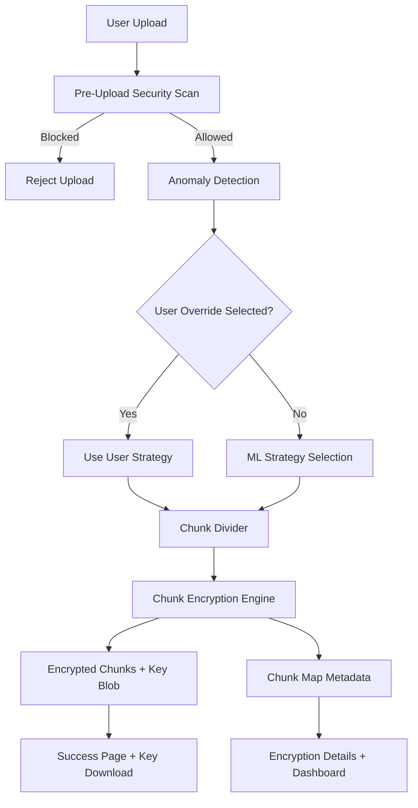
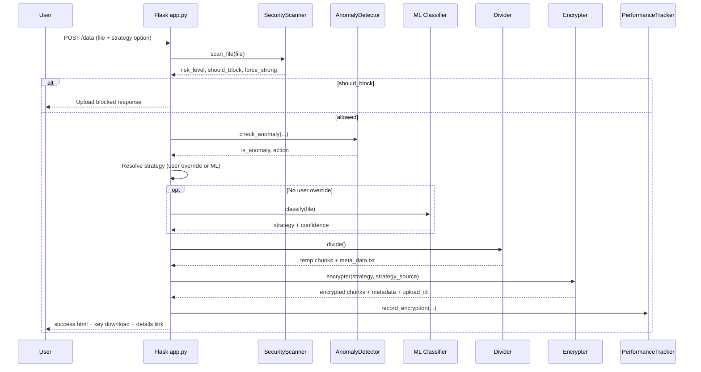
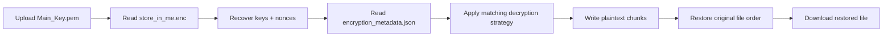
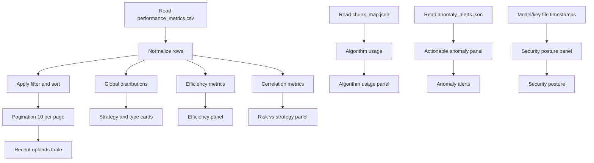

## Secure File Storage Using Hybrid Cryptography and ML

This document explains the end-to-end technical implementation of the project: encryption/decryption pipeline, ML-assisted strategy selection, chunk metadata design, dashboard analytics, and export/reporting capabilities.

---

## 1. System Architecture

### 1.1 High-Level Data Flow

### 1.2 Runtime Components

| Component | Responsibility | Key Outputs |
|---|---|---|
| app.py | Flask routes and orchestration | Upload/decrypt flows, dashboard payload |
| divider.py | File splitting into chunks | SECRET0000000... files, meta_data.txt |
| encrypter.py | Strategy-aware chunk encryption | data/encrypted/*, store_in_me.enc, chunk_map.json |
| decrypter.py | Strategy-aware decryption | data/temp_files/* plaintext chunks |
| restore.py | Chunk merge to original file | data/restored/<original> |
| ml/classifier.py | ML recommendation | STRONG/BALANCED/FAST + confidence |
| ml/security_scanner.py | Risk analysis before encryption | risk_level, force/block hints |
| ml/anomaly_detector.py | Behavioral anomaly checks | anomaly alerts + action hints |
| ml/metrics.py | Performance logging | performance_metrics.csv, summary stats |

---

## 2. Cryptographic Design

### 2.1 Algorithms Used

| Algorithm | Class | Use in Project | Notes |
|---|---|---|---|
| MultiFernet | Symmetric/authenticated token | STRONG rotation slot 0 | Uses two Fernet keys for rotation |
| ChaCha20-Poly1305 | AEAD | STRONG slot 1 and FAST mode | Uses nonce12 |
| AES-GCM | AEAD | STRONG slot 2 and BALANCED mode | Uses nonce12 |
| AES-CCM | AEAD | STRONG slot 3 | Uses nonce13 |

### 2.2 Strategy Policy

| Strategy | Chunk Pattern | Intended Tradeoff |
|---|---|---|
| STRONG | Rotates 4 algorithms by chunk index % 4 | Maximum diversity and security hardness |
| BALANCED | AES-GCM on every chunk | Security + performance balance |
| FAST | ChaCha20 on every chunk | Throughput oriented |

### 2.3 Key Material and Storage

- Session keys/nonces are generated per encryption operation.
- Combined key payload is encrypted and stored as data/raw_data/store_in_me.enc.
- Main_Key.pem stores the wrapper key needed for decryption.
- Encryption strategy/version are persisted in data/raw_data/encryption_metadata.json.

---

## 3. Upload and Encryption Flow

### 3.1 Detailed Sequence

### 3.2 Strategy Resolution Rules

| Rule | Behavior |
|---|---|
| User selected strong/balanced/fast | Explicit strategy is applied |
| User selected ml_recommended | ML classifier output is applied |
| ML unavailable or error | Fallback strategy is STRONG |
| User-first policy | Explicit user override is honored |

---

## 4. Decryption and Restore Flow

| Step | Module | Purpose |
|---|---|---|
| Key upload | app.py /download_data | Accept user decryption key |
| Key decode | decrypter.py | Recover all strategy keys and nonces |
| Strategy detect | decrypter.py | Read persisted strategy metadata |
| Chunk decrypt | decrypter.py | Decrypt each encrypted chunk |
| File restore | restore.py | Concatenate plaintext chunks in order |

---

## 5. Chunk Metadata and Explainability

### 5.1 Chunk Map Schema (data/raw_data/chunk_map.json)

Each upload record stores:

| Field | Meaning |
|---|---|
| upload_id | Unique operation id |
| timestamp | Encryption completion timestamp |
| file_name | Original uploaded file name |
| strategy | STRONG/BALANCED/FAST |
| strategy_source | ML Recommended / User Override / Forced by Security |
| total_chunks | Number of generated chunks |
| chunks[] | Per-chunk algorithm map |

Per chunk:

| Field | Meaning |
|---|---|
| chunk_id | Zero-based chunk index |
| chunk_name | Internal file name |
| size_kb | Chunk size in KB |
| algorithm | Algorithm used for this chunk |
| key_type | Symmetric or AEAD |
| nonce_used | nonce12 / nonce13 / - |
| order | Human-readable 1..N order |

### 5.2 Encryption Details Page

- Route: /encryption-details/<upload_id>
- Shows chunk table + aggregate analysis:
  - total size,
  - average chunk size,
  - max chunk size,
  - algorithms used.

---

## 6. Dashboard Analytics Implementation

### 6.1 Dashboard Data Pipeline

### 6.2 Panels and Metrics

| Panel | Metrics |
|---|---|
| Top stats | total files, avg encryption time, avg ML confidence, anomaly count |
| Encryption Efficiency | avg chunks/file, avg overhead %, avg entropy gain, throughput MB/s |
| Algorithm Usage | count and percentage per algorithm |
| Risk vs Strategy Correlation | HIGH_RISK->STRONG, SAFE->FAST, MEDIUM_RISK->BALANCED |
| Chunk Statistics | avg/min/max chunks, largest file processed |
| Security Posture | scanner/model status, last anomaly, last malware detection, model trained time, key status |
| Trends | encryption time trend, confidence trend |

### 6.3 Recent Uploads Table Columns

| Column | Source |
|---|---|
| Time, File, Type | metrics CSV |
| Size, Chunks | metrics CSV |
| Overhead | metrics CSV |
| Strategy, Risk | metrics CSV |
| Source | strategy_source from chunk map (fallback defaults) |
| Integrity | success flag |
| Details | upload_id mapping to details page |

### 6.4 Filters, Sorting, Pagination

| Control | Supported Values |
|---|---|
| Strategy filter | ALL, STRONG, BALANCED, FAST |
| Risk filter | ALL, SAFE, LOW_RISK, MEDIUM_RISK, HIGH_RISK |
| Sort key | timestamp, file_name, strategy, security_risk, encryption_time_ms, file_size_kb, num_chunks |
| Sort direction | asc, desc |
| Pagination | page query param, 10 rows/page |

### 6.5 Export Analytics

- Route: /dashboard/export
- Formats:
  - format=csv (table export)
  - format=json (structured dashboard payload)

---

## 7. Route Map

| Route | Method | Purpose |
|---|---|---|
| / | GET | Home |
| /upload | GET | Upload page |
| /data | POST | Encrypt pipeline trigger |
| /return-key | GET | Download encryption key |
| /download | GET | Decrypt page |
| /download_data | GET/POST | Key upload + decrypt pipeline |
| /return-file/ | GET | Download restored file |
| /dashboard | GET | Analytics dashboard |
| /dashboard/export | GET | Export analytics CSV/JSON |
| /encryption-details/<upload_id> | GET | Chunk-level details page |
| /api/metrics | GET | Summary metrics API |

---

## 8. Configuration Summary

| Config Key | Current Purpose |
|---|---|
| CHUNK_SIZE | Chunk size for divider (32 KB default) |
| MAX_FILE_SIZE | Upload limit |
| ENABLE_ML_SELECTION | Enable/disable ML strategy mode |
| DATA_DIR and folder paths | Data storage layout |
| HOST/PORT/DEBUG | Flask runtime configuration |

---

## 9. Validation Checklist

| Test | Expected Result |
|---|---|
| Upload with ML recommended | Strategy selected by model and shown in dashboard |
| Upload with force balanced | Strategy BALANCED appears in logs/distribution |
| Security high risk + user override | User-selected strategy honored (user-first policy) |
| Key download and decrypt | Restored file matches input |
| Dashboard filter/sort/page | Rows and stats respond correctly |
| Details page from dashboard row | Correct chunk table opens |
| Export CSV/JSON | Valid downloadable analytics output |

---

## 10. Research Readiness Notes

- Hybrid claim is evidenced by chunk-level algorithm usage map.
- Performance claim is evidenced by timing, throughput, and overhead metrics.
- Security claim is evidenced by scanner risk labels and anomaly action logs.
- Explainability claim is evidenced by strategy source + details linkage.
- Reporting claim is evidenced by dashboard exports and tabular analytics.

