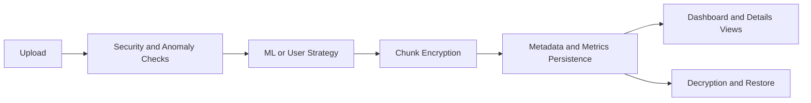

## Refactor Summary and Feature Implementation Overview

This file provides a concise but technical summary of what has been refactored and what is currently implemented in the project.

---

## 1. Refactor Goals Achieved

| Goal | Outcome |
|---|---|
| Separate code and generated data | Completed via data/ directory hierarchy |
| Centralized configuration | Completed via config.py |
| Modularized workflow | Completed via dedicated divider/encrypter/decrypter/restore modules |
| Add explainability metadata | Completed via chunk_map.json + details page |
| Add analytics observability | Completed via metrics logs + advanced dashboard |

---

## 2. Architecture Before vs After

### Before

- Limited metadata visibility.
- No chunk-level explainability table.
- Basic dashboard scope.
- Strategy tracking less explicit.

### After

- Full chunk-level mapping and per-upload history.
- Strategy source traceability (ML/User/Forced).
- Security + anomaly context integrated into analytics.
- Exportable dashboard analytics with filters/sort/pagination.

---

## 3. Cryptography and Pipeline Overview

| Area | Implementation |
|---|---|
| Chunking | Fixed-size chunking with ordered merge support |
| Encryption strategies | STRONG rotation, BALANCED AES-GCM, FAST ChaCha20 |
| Key storage | Encrypted key blob + downloadable wrapper key |
| Decryption logic | Metadata-driven strategy-aware decrypt |
| Restore | Ordered chunk concatenation |

---

## 4. ML and Security Integration

| Module | Implementation Summary |
|---|---|
| Classifier | RandomForest-based strategy recommendation |
| Security scanner | Risk labels and blocking/escalation hints |
| Anomaly detector | Behavior checks with confidence/action output |
| Metrics tracker | CSV-backed encryption/decryption telemetry |

Policy note:
- Current decision policy is user-first when explicit override is selected.

---

## 5. Metadata and Explainability Features

| Feature | Status |
|---|---|
| encryption_metadata.json | Implemented |
| chunk_map.json with history | Implemented |
| strategy_source persistence | Implemented |
| encryption details page | Implemented |
| dashboard row -> details linkage | Implemented |

---

## 6. Dashboard Feature Matrix

| Category | Implemented Features |
|---|---|
| Core stats | file count, avg time, avg confidence, anomaly count |
| Efficiency | avg chunks/file, overhead, entropy gain, throughput |
| Usage breakdown | algorithm usage counts and percentages |
| Correlation | risk-to-strategy correlation metrics |
| Chunk analytics | avg/min/max chunks, largest file |
| Table enrichment | size, chunks, overhead, source, integrity, details |
| Controls | filter, sort, pagination (10/page) |
| Security posture | runtime statuses + last event timestamps |
| Trends | encryption-time and confidence trend indicators |
| Export | CSV and JSON dashboard export |

---

## 7. Stability and Bug Fixes Included

| Issue | Fix |
|---|---|
| download_data GET returning invalid response | Added valid GET response rendering |
| Strategy override case mismatch | Normalized override value handling |
| Details N/A due to filename mismatch | Added filename normalization and fallback matching |
| Stats capped by visible rows | Global metrics now computed from full history |

---

## 8. Operational Readiness Snapshot

### Suitable For

- Technical demos,
- paper screenshots and metric tables,
- comparative strategy discussions,
- export-driven report generation.

### Future Expansion Path

| Next Upgrade | Benefit |
|---|---|
| Database-backed analytics store | Better multi-user scale and complex querying |
| Authentication/authorization | User-level access control |
| Async processing queue | Better throughput for large files |
| Integrity hash dashboarding | Stronger cryptographic verification reporting |

---

## 9. Working Summary in One Table

| Layer | Current State |
|---|---|
| Upload and validation | Working |
| ML strategy selection | Working |
| User override strategy | Working |
| Hybrid chunk encryption | Working |
| Key generation and retrieval | Working |
| Decryption and restore | Working |
| Chunk map details page | Working |
| Advanced analytics dashboard | Working |
| Export analytics | Working |

